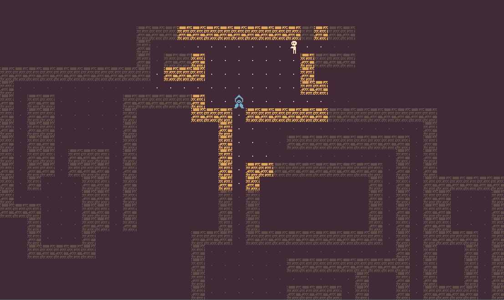
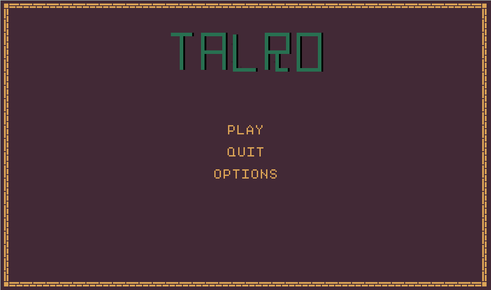

## A LÖVE Roguelike. Still in early development.

### Expected features
* A generated pyramid to explore
* Interesting items and monsters

### Libraries used
* [rotLove](https://github.com/paulofmandown/rotLove), with some modifications
* [hump.gamestate](https://github.com/vrld/hump)
* [uuid](https://github.com/Tieske/uuid)
* [Gspot](https://notabug.org/pgimeno/Gspot)
* [serpent](https://github.com/pkulchenko/serpent)
* [lua-star](https://github.com/wesleywerner/lua-star)

### Special thanks
* [MCNoodlor](https://twitter.com/mcnoodlor) for some of his tiles 

### A sneak peak

